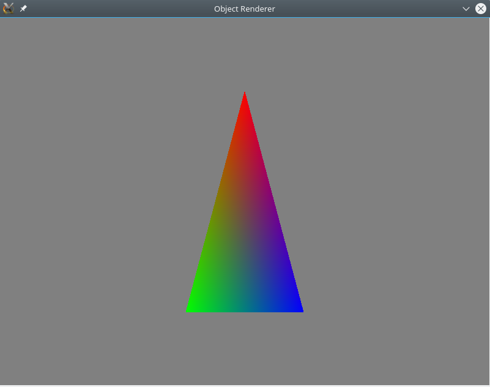

# A simple cube and triangle renderer

Made with SDL2 + OpenGL.

**Be aware that this isn't good C++ code, never do this in a real project!** This
was just used in a Computer Graphics presentation. The images below demonstrate
what can be visualized.

